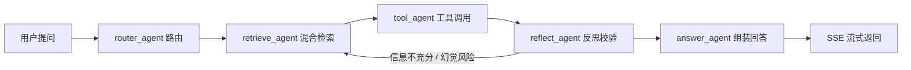

# 学智汇

> 面向校园垂直领域的多 Agent 协同 RAG 问答系统

SpringBoot + FastAPI + LangGraph 双服务架构，实现五大角色 Agent 协同，基于 Milvus 构建垂直知识库；支持混合检索、反思幻觉抑制、SSE 流式对话，Docker Compose 一键部署。

---

## 目录

- [项目简介](#项目简介)
- [技术栈](#技术栈)
- [系统架构](#系统架构)
- [项目结构](#项目结构)
- [核心设计要点](#核心设计要点)
- [快速启动（Docker Compose）](#快速启动docker-compose)
- [本地开发](#本地开发)
- [接口文档](#接口文档)
- [环境依赖](#环境依赖)

---

## 项目简介

面向校园场景（课程、教务、校园生活等）的垂直领域问答系统。用户上传文档后自动向量化入库，提问时由 5 个 Agent 角色协同完成"路由 → 检索 → 工具调用 → 反思校验 → 回答组装"的完整链路，支持循环重试与幻觉抑制，并通过 SSE 流式返回答案。

## 技术栈

| 模块 | 技术 |
| --- | --- |
| Java 业务服务 | Spring Boot、MyBatis‑Plus、OpenFeign、Redis、SSE、Flyway |
| Python Agent 服务 | FastAPI、LangGraph、LangChain、pymilvus、rank_bm25、sentence‑transformers |
| 存储 | MySQL（业务数据）、Redis（会话记忆 / Agent 状态 / 任务）、Milvus（向量库） |
| LLM | Ollama（本地）/ DeepSeek（云端）统一封装 |
| 部署 | Docker Compose 一键编排 |

## 系统架构

```
                         前端 Web（登录 / 上传文档 / 对话）
                                  │  HTTP / SSE
                                  ▼
                 ┌────────────────────────────────────┐
                 │        Java‑Backend (SpringBoot)   │
                 │  鉴权 · 知识库管理 · 长任务管理      │
                 │  SSE 转发 · MySQL 业务数据          │
                 └───────┬────────────────────────────┘
                         │ Feign 调用 / SSE 流式转发
                         ▼
          ┌───────────────────────────────────────────┐
          │   Python‑Agent (FastAPI + LangGraph)      │
          │                                           │
          │     router_agent（路由）                    │
          │          │                                │
          │          ▼                                │
          │     retrieve_agent（BM25 + 向量混合检索）    │
          │          │                                │
          │          ▼                                │
          │     tool_agent（回调 Java 取业务数据）       │
          │          │                                │
          │          ▼                                │
          │     reflect_agent（幻觉校验 · 判断二次检索）  │
          │          │              ▲                 │
          │          │  循环重试/二次检索               │
          │          ▼              └─────────────────┘
          │     answer_agent（回答组装）                │
          └──┬─────────┬────────────┬─────────────────┘
             │         │            │
             ▼         ▼            ▼
          Milvus    Redis        LLM(Ollama/DeepSeek)
          向量库   会话/Agent状态     生成

  文档入库链路：前端上传 → Java 基础解析 → 调用 Python 向量化接口 → 分块 → Milvus 入库
```

**五大 Agent 协同流程：**



## 项目结构

```
├── docker-compose.yml          # 整体编排：java、python-agent、redis、milvus
├── .gitignore
├── README.md                   # 项目介绍、架构图、启动步骤、接口文档
├── java-backend/               # SpringBoot 业务服务
│   ├── Dockerfile
│   ├── pom.xml
│   └── src/main/java/com/agent/rag
│       ├── RAGApplication.java                 # 启动类
│       ├── config/                             # Feign/Redis/SSE/Web 配置
│       ├── client/                             # Feign 客户端，调用 Python Agent
│       ├── controller/                         # Auth / Knowledge / Chat / Task
│       ├── service/                            # 业务接口 + impl 实现
│       ├── mapper/                             # MyBatis‑Plus，操作 MySQL
│       ├── entity/                             # 用户、知识库、对话记录、任务实体
│       ├── dto/                                # req 请求 / resp 返回 DTO
│       ├── exception/                          # 全局异常、降级处理
│       └── util/                               # SSE 工具等
│   └── src/main/resources
│       ├── application.yml
│       └── db/migration/                       # Flyway 数据库初始化脚本
└── python-agent/               # FastAPI + LangGraph Agent 服务
    ├── Dockerfile
    ├── requirements.txt
    ├── main.py                 # FastAPI 入口
    ├── .env                    # LLM / Redis / Milvus 配置（不入库，参考 .env.example）
    ├── api/                    # 对话接口、文档向量化入库接口
    ├── agent/                  # LangGraph 状态图 + 5 个 Agent 节点 + tools
    ├── rag/                    # 分块、混合检索、重排
    ├── llm/                    # 大模型统一封装（Ollama / DeepSeek）
    ├── storage/                # Redis / Milvus 封装
    └── utils/                  # 日志埋点、异常定义
```

## 核心设计要点

### Java‑backend 职责

1. 用户登录、鉴权、权限校验；
2. MySQL：用户、知识库元数据、对话记录、异步任务状态；
3. 接收前端上传文件，做基础解析，调用 python‑agent 接口做向量化入库；
4. SSE 接收前端，调用 Python SSE 接口，把 token 流式透传给前端；
5. Feign 调用 Agent 普通接口；长耗时任务写入 Redis 消息队列；
6. **Python Agent 需要业务数据时，请求 Java 的 controller 接口，带上鉴权信息**。

### python‑agent 职责

1. 只处理 AI 相关逻辑，**不直接访问 MySQL**；
2. LangGraph 状态图，5 个 Agent 节点流转，支持循环重试；
3. RAG 全套：文档分块（语义分块 + 重叠窗口）、混合检索（BM25 + 向量）、交叉编码器重排；
4. 读写 Milvus 向量库；读写 Redis 存放会话、Agent 状态；
5. 提供接口给 Java 调用；必要时回调 Java 接口获取业务数据。

## 快速启动（Docker Compose）

前置要求：已安装 Docker 与 Docker Compose。

```bash
# 1. 配置环境变量（首次）
cp python-agent/.env.example python-agent/.env   # 填写 LLM / Redis / Milvus 配置

# 2. 一键编排启动 java、python-agent、redis、milvus
docker compose up -d --build

# 3. 查看日志
docker compose logs -f

# 4. 停止
docker compose down
```

启动后访问：
- Java 服务：`http://localhost:8080`
- Python Agent 服务：`http://localhost:8000/docs`（Swagger UI）

## 本地开发

### 1. 启动依赖服务

Redis、Milvus、MySQL（可先用 Docker 单独启动，或直接使用 `docker compose up redis milvus`）。

### 2. 启动 java-backend

```bash
cd java-backend
./mvnw spring-boot:run
```

- 配置在 `src/main/resources/application.yml`（MySQL / Redis 连接、Python Agent 地址、SSE 配置）
- Flyway 会在启动时自动执行 `db/migration/` 下的建表脚本

### 3. 启动 python-agent

```bash
cd python-agent
pip install -r requirements.txt
uvicorn main:app --reload --port 8000
```

- 配置在 `.env`（LLM 类型与 Key、Redis、Milvus 连接）

## 接口文档

### Java 对外接口（前端调用）

| 方法 | 路径 | 说明 |
| --- | --- | --- |
| POST | `/api/auth/login` | 登录鉴权 |
| POST | `/api/knowledge/upload` | 上传知识库文档 |
| GET | `/api/chat/stream?sessionId=xxx` | SSE 流式对话 |
| POST | `/api/task/submit` | 提交长耗时 Agent 任务 |
| GET | `/api/task/{taskId}` | 查询任务结果 |

### Python Agent 接口（Java 调用）

| 方法 | 路径 | 说明 |
| --- | --- | --- |
| POST | `/api/agent/chat` | 普通对话 |
| GET | `/api/agent/stream?session_id=xxx` | SSE 流式 Agent |
| POST | `/api/knowledge/vectorize` | 文档向量化入库 |

### Python 回调 Java（获取业务数据）

> 示例：`GET /api/business/data/query`，带上 token 鉴权，Java 校验权限后返回业务数据。

## 环境依赖

- **MySQL**：用户、知识库元数据、对话记录、任务状态
- **Redis**：会话记忆、Agent 状态、长任务消息队列
- **Milvus**：知识库向量存储与检索
- **LLM**：Ollama（本地）或 DeepSeek（云端，需 API Key）

---

*更多实现细节见 [docs/项目结构.md](docs/项目结构.md)。*
