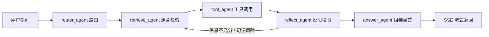

# 学智汇

> 面向校园垂直领域的多 Agent 协同 RAG 问答系统

Vue3 + SpringBoot + FastAPI/LangGraph 前后端分离架构。五大角色 Agent 协同，基于 Milvus 构建垂直知识库；支持混合检索、反思幻觉抑制、SSE 流式对话，并配套知识库管理、公开知识库、历史对话、管理员后台等完整业务闭环，Docker Compose 一键部署。

---

## 目录

- [项目简介](#项目简介)
- [技术栈](#技术栈)
- [系统架构](#系统架构)
- [项目结构](#项目结构)
- [核心设计要点](#核心设计要点)
- [快速启动（Docker Compose）](#快速启动docker-compose)
- [本地开发](#本地开发)
- [接口文档](#接口文档)
- [环境依赖](#环境依赖)

---

## 项目简介

面向校园场景（课程、教务、校园生活等）的垂直领域问答系统。用户上传文档后自动向量化入库，提问时由 5 个 Agent 角色协同完成"路由 → 检索 → 工具调用 → 反思校验 → 回答组装"的完整链路，支持循环重试与幻觉抑制，并通过 SSE 流式返回答案。

除问答外，提供完整的知识库管理闭环：

- **我的知识库**：新建 / 编辑 / 删除、封面上传、文档上传与批量向量化入库
- **公开知识库**：浏览他人分享的知识库，收藏、一键复制为可编辑副本
- **历史对话**：会话列表、历史消息持久化到 MySQL（含回答属性、思考过程、参考文献）
- **管理员后台**：用户禁用 / 恢复 / 角色管理；知识库与文档的彻底删除、恢复、向量删除与重入库（含重复文件哈希封禁）

## 技术栈

| 模块 | 技术 |
| --- | --- |
| 前端 | Vue 3、Vite、Element Plus、Pinia、Axios、Vue Router、Vitest |
| Java 业务服务 | Spring Boot 3、MyBatis-Plus、OpenFeign、Redis、SSE、JWT、Caffeine、腾讯云 COS、jsoup、knife4j |
| Python Agent 服务 | FastAPI、LangGraph、LangChain、pymilvus、rank_bm25、sentence-transformers |
| 存储 | MySQL（业务数据）、Redis（会话记忆 / Agent 状态 / 任务队列）、Milvus（向量库，依赖 etcd + MinIO） |
| LLM | DeepSeek（OpenAI 兼容接口）；本地开发可用 MockLLM 兜底 |
| 部署 | Docker Compose 一键编排（7 个服务） |

## 系统架构

```
                     前端 Web（Vue3 + Element Plus：对话 / 知识库 / 管理后台）
                                  │  HTTP / SSE
                                  ▼
                 ┌────────────────────────────────────┐
                 │        Java‑Backend (SpringBoot)   │
                 │  鉴权 · 知识库管理 · 对话存储        │
                 │  SSE 转发 · 长任务队列 · 管理员       │
                 └───────┬────────────────────────────┘
                         │ Feign 调用 / SSE 流式转发（AGENT_TOKEN 校验）
                         ▼
          ┌───────────────────────────────────────────┐
          │   Python‑Agent (FastAPI + LangGraph)      │
          │                                           │
          │     router_agent（路由）                    │
          │          │                                │
          │          ▼                                │
          │     retrieve_agent（BM25 + 向量混合检索）    │
          │          │                                │
          │          ▼                                │
          │     tool_agent（回调 Java 取业务数据）       │
          │          │                                │
          │          ▼                                │
          │     reflect_agent（幻觉校验 · 判断二次检索）  │
          │          │              ▲                 │
          │          │  循环重试/二次检索               │
          │          ▼              └─────────────────┘
          │     answer_agent（回答组装）                │
          └──┬─────────┬────────────┬─────────────────┘
             │         │            │
             ▼         ▼            ▼
          Milvus    Redis        DeepSeek LLM
          向量库   会话/Agent状态    生成

  文档入库链路：前端上传 → Java 解析（jsoup / pypdf / python-docx）→ 调用 Python 向量化接口 → 分块 → Milvus 入库 → 回调 Java 更新向量状态
```

**五大 Agent 协同流程：**



## 项目结构

```
学智汇/
├── frontend/                 # Vue3 前端（对话 / 知识库 / 公开知识库 / 管理后台）
├── java-backend/             # SpringBoot 业务服务（对外接口 + 权限 + 业务存储）
├── python-agent/             # FastAPI + LangGraph Agent 服务（AI 逻辑）
├── docs/                     # 项目设计文档（项目计划、项目结构）
├── docker-compose.yml        # 一键编排：mysql、redis、etcd、minio、milvus、java、python
├── docker-compose.pull-mirror.yml   # 国内镜像加速版本
├── .env                      # 部署密钥（DEEPSEEK_API_KEY / AGENT_TOKEN / JWT_SECRET，不入库）
├── mianshi/                  # 面试准备材料
└── README.md
```

详细结构见 [docs/项目结构.md](docs/项目结构.md)。

## 核心设计要点

### 前端职责

1. Vue 3 + Element Plus 单页应用，Pinia 状态管理，Axios 统一封装（token 注入、登录失效自动跳转）；
2. 对话页 SSE 流式打字机效果，回答附带思考过程（工具调用）、来源文档、参考文献（可折叠）；
3. 我的知识库 / 公开知识库 / 知识库详情（文档管理与批量操作）/ 设置 / 管理员后台完整页面。

### Java-backend 职责

1. 用户登录、JWT 鉴权，LoginInterceptor + `@RequireRole` 角色权限校验；
2. MySQL：用户、知识库 / 文档、收藏 / 成员、对话记录（会话 + 消息 + 思考 + 参考文献）、封禁文件哈希；
3. 接收前端上传文件，做基础解析与文件落盘，调用 python-agent 做向量化入库 / 删向量；
4. SSE 接收前端，调用 Python SSE 接口，把 token 流式透传给前端；
5. Feign 调用 Agent 普通接口；长耗时向量化任务写入 Redis List，Python worker 消费，前端轮询任务状态；
6. **Python Agent 需要业务数据时，通过 `/internal/agent/*` 回调 Java，Java 校验 `AGENT_TOKEN`**；
7. 管理员能力：用户禁用 / 恢复、角色管理，知识库与文档的彻底删除 / 恢复 / 清向量，重复文件哈希封禁。

### python-agent 职责

1. 只处理 AI 相关逻辑，**不直接访问 MySQL**；
2. LangGraph 状态图，5 个 Agent 节点流转，支持循环重试；
3. RAG 全套：文档分块（语义分块 + 重叠窗口）、混合检索（BM25 + 向量）、交叉编码器重排；
4. 读写 Milvus 向量库；读写 Redis 存放会话、Agent 状态、任务；
5. 提供接口给 Java 调用（`AGENT_TOKEN` 校验）；必要时回调 Java 接口获取业务数据。

## 快速启动（Docker Compose）

前置要求：已安装 Docker 与 Docker Compose。

```bash
# 1. 配置部署密钥：编辑根目录 .env（docker compose 自动读取）
#    DEEPSEEK_API_KEY=<必填，DeepSeek 平台获取>
#    AGENT_TOKEN=<强随机值>   # Java 调 Python 的内部鉴权
#    JWT_SECRET=<强随机值>    # Java 登录 JWT 签名
#    MYSQL_ROOT_PASSWORD=<可选，默认 111111>

# 2. 一键编排启动（mysql/redis/etcd/minio/milvus/java/python 共 7 个服务）
docker compose up -d --build

# 3. 查看日志
docker compose logs -f

# 4. 停止
docker compose down
```

启动后访问：

- 前端：`http://localhost:5173`
- Java 接口文档（knife4j）：`http://localhost:8123/api/doc.html`
- Python Agent Swagger：`http://localhost:8000/docs`
- MinIO 控制台：`http://localhost:9001`（minioadmin / minioadmin）
- MySQL 宿主端口：`3307`

## 本地开发

### 1. 启动依赖服务

```bash
docker compose up mysql redis etcd minio milvus -d
```

MySQL 首次启动会自动执行 `java-backend/sql/init.sql` 建表。

### 2. 启动 java-backend

```bash
cd java-backend
./mvnw spring-boot:run
```

- 配置在 `src/main/resources/application.yml`（MySQL / Redis / Python Agent 地址；本地端口 `8123`，context-path=`/api`）
- 需设置环境变量 `JWT_SECRET`（本地开发可临时给任意字符串）

### 3. 启动 python-agent

```bash
cd python-agent
pip install -r requirements.txt
uvicorn main:app --reload --port 8000
```

- 配置在 `.env`（`DEEPSEEK_API_KEY`、`AGENT_TOKEN`、`JAVA_BASE_URL`、`VECTOR_STORE=milvus|local`）
- 本地无 Key 时可设 `ALLOW_MOCK_LLM=true` 用 MockLLM 兜底（仅限开发环境）

### 4. 启动前端

```bash
cd frontend
npm install
npm run dev
```

- 开发地址 `http://localhost:5173`，Vite 已把 `/api` 代理到 `http://localhost:8123`

## 接口文档

### Java 对外接口（前端调用，统一前缀 `/api`）

**认证**

| 方法 | 路径 | 说明 |
| --- | --- | --- |
| POST | `/api/auth/register` | 注册 |
| POST | `/api/auth/login` | 登录 |
| POST | `/api/auth/logout` | 退出登录 |
| GET | `/api/auth/me` | 当前用户信息 |

**知识库**

| 方法 | 路径 | 说明 |
| --- | --- | --- |
| POST | `/api/knowledge/create` | 创建知识库 |
| POST | `/api/knowledge/update` | 更新知识库 |
| GET | `/api/knowledge/list` | 我的 + 收藏列表 |
| GET | `/api/knowledge/public/list` | 公开知识库列表 |
| GET | `/api/knowledge/{id}` | 知识库详情 |
| POST / DELETE | `/api/knowledge/{id}/favorite` | 收藏 / 取消收藏 |
| POST | `/api/knowledge/{id}/copy` | 复制为副本 |
| POST | `/api/knowledge/cover` | 封面上传 |
| GET / POST / DELETE | `/api/knowledge/{id}/members[/{userId}]` | 成员（协作者）管理 |
| DELETE | `/api/knowledge/{id}` | 删除知识库（逻辑删除） |

**文档**

| 方法 | 路径 | 说明 |
| --- | --- | --- |
| POST | `/api/knowledge/{id}/upload` | 上传文档 |
| GET | `/api/knowledge/{id}/docs` | 文档列表 |
| POST | `/api/knowledge/{id}/docs/batch-vectorize` | 批量向量化入库 |
| POST | `/api/knowledge/{id}/docs/batch-delete` | 批量删除文档 |
| POST | `/api/knowledge/{id}/docs/batch-remove-vector` | 批量删除向量 |
| DELETE | `/api/knowledge/{id}/docs/{docId}` | 删除文档 |
| POST | `/api/knowledge/{id}/docs/{docId}/revectorize` | 重新向量化入库 |
| POST | `/api/knowledge/{id}/docs/{docId}/remove-vector` | 删除向量 |
| POST | `/api/knowledge/{id}/docs/{docId}/restore` | 恢复文档 |
| DELETE | `/api/knowledge/{id}/docs/{docId}/purge` | 彻底删除文档 |

**对话 / 任务 / 设置**

| 方法 | 路径 | 说明 |
| --- | --- | --- |
| POST | `/api/chat` | 非流式对话 |
| GET | `/api/chat/stream?sessionId=` | SSE 流式对话 |
| GET | `/api/chat/sessions` | 会话列表 |
| GET | `/api/chat/sessions/{sessionId}/history` | 历史消息（含思考、参考文献） |
| DELETE | `/api/chat/sessions/{sessionId}` | 删除会话 |
| GET | `/api/task/{id}` | 查询向量化任务状态 |
| GET | `/api/settings` | 查询用户设置 |
| PUT | `/api/settings/vectorize-default` | 上传文档默认入库开关 |
| PUT | `/api/settings/collapse-refs` | 参考文献默认折叠开关 |

**管理员（需管理员角色）**

| 方法 | 路径 | 说明 |
| --- | --- | --- |
| GET | `/api/admin/user/list` | 用户列表 |
| PUT | `/api/admin/user/{id}/role` | 修改用户角色 |
| DELETE / PUT | `/api/admin/user/{id}` 、 `/restore` | 禁用 / 恢复用户 |
| GET | `/api/admin/knowledge/list`、`/api/admin/knowledge/{id}/docs` | 全局知识库 / 文档列表 |
| DELETE / PUT | `/api/admin/knowledge/{id}` 、 `/restore` | 彻底删除 / 恢复知识库 |
| DELETE / PUT / POST / POST | `/api/admin/knowledge/{id}/docs/{docId}`（`/restore` `/revectorize` `/remove-vector`） | 文档删除 / 恢复 / 重入库 / 清向量 |
| POST | `/api/admin/knowledge/{id}/docs/batch-remove-vector`、`/batch-delete` | 批量操作 |

### Python Agent 接口（Java 调用，需携带 `AGENT_TOKEN`）

| 方法 | 路径 | 说明 |
| --- | --- | --- |
| POST | `/api/agent/chat` | 普通对话 |
| GET | `/api/agent/stream?session_id=` | SSE 流式 Agent |
| POST | `/api/knowledge/vectorize` | 文档向量化入库 |
| POST | `/api/knowledge/delete` | 删除文档向量 |

### Python 回调 Java（Java 校验 `AGENT_TOKEN`，前缀 `/api/internal/agent`）

| 方法 | 路径 | 说明 |
| --- | --- | --- |
| GET | `/internal/agent/user-stats` | Agent 获取业务数据 |
| POST | `/internal/agent/chat-save` | 回写对话（回答 / 思考 / 参考文献） |
| POST | `/internal/agent/vector-callback` | 向量化结果回调 |

## 环境依赖

- **MySQL 8.0**：用户、知识库 / 文档、收藏 / 成员、对话记录、封禁哈希（docker-compose 挂载 `java-backend/sql/init.sql` 初始化建表）
- **Redis 7**：会话记忆、Agent 状态、向量化任务队列
- **Milvus 2.4 + etcd + MinIO**：知识库向量存储与检索
- **LLM**：DeepSeek API（OpenAI 兼容接口）；开发环境可用 MockLLM 兜底

---

*更多实现细节见 [docs/项目结构.md](docs/项目结构.md)。*
